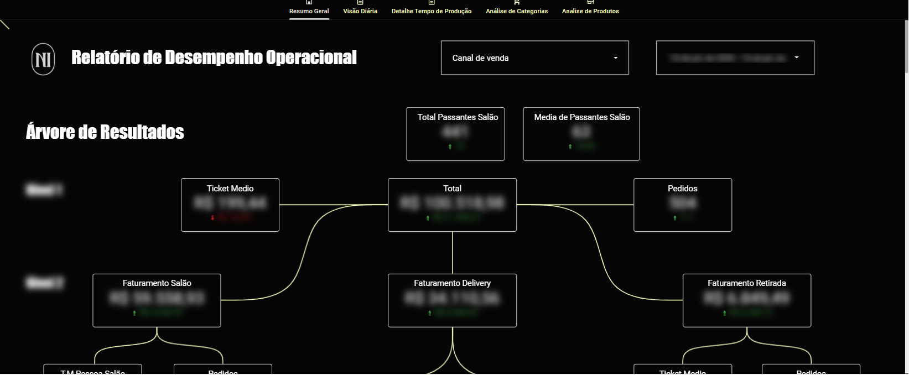
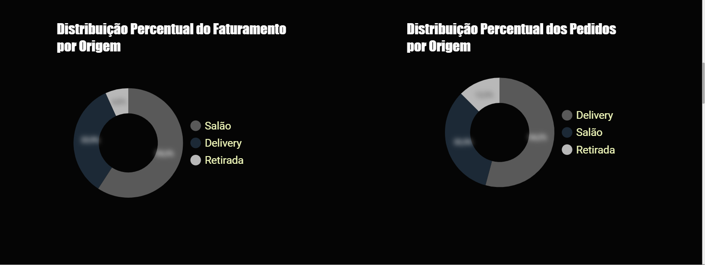
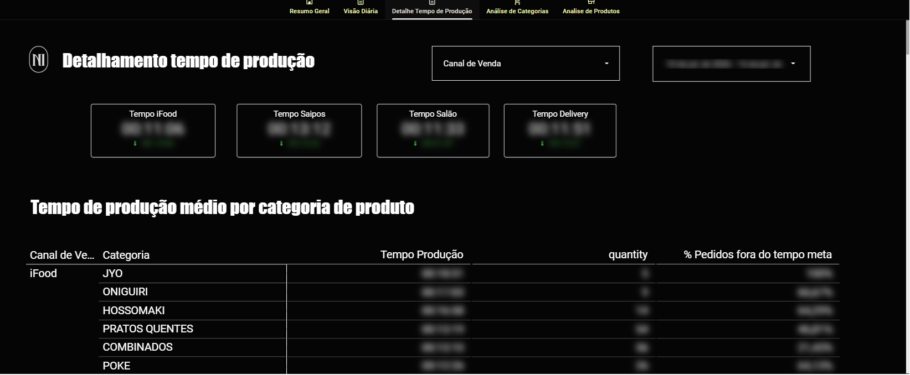
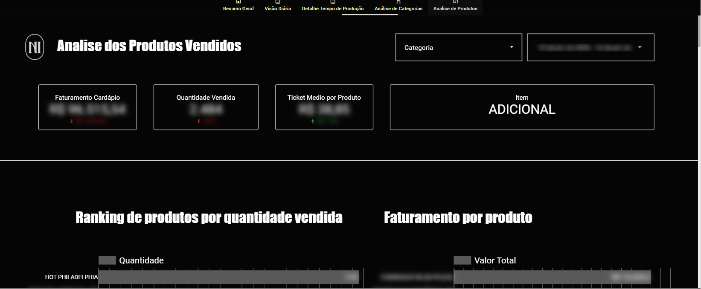

# 01 · Dashboard de Desempenho Operacional

> Visão única de faturamento, tempo de produção e cardápio, alimentada automaticamente via API do ERP — substituindo a consolidação manual de relatórios.

## Contexto

A operação precisava acompanhar diariamente o desempenho de vendas por canal (salão, delivery, retirada, iFood), o tempo de produção da cozinha e o desempenho dos itens do cardápio. Antes, esses dados ficavam espalhados em relatórios do ERP e planilhas soltas, exigindo horas de consolidação manual por semana.

## Arquitetura e fontes de dados

O diferencial deste projeto é a **integração via API**: desenvolvi um coletor em **JavaScript (Google Apps Script)** que consome a **API REST do ERP Saipos**, trata os dados e grava em Google Sheets, que alimenta o Looker Studio de forma automatizada.

```
API Saipos ──► Apps Script (JavaScript) ──► Google Sheets ──► Looker Studio
```

Pontos técnicos do coletor:

- **Deduplicação por chave única** de item de venda, evitando duplicidade quando a API repete sequências em itens iguais do mesmo pedido;
- **Retry com backoff** para falhas intermitentes da API (timeouts 504);
- **Regras de virada de turno**: fichas fechadas após a meia-noite são atribuídas ao turno/dia operacional correto, e não à data-calendário da gravação;
- Execução agendada (gatilhos de tempo), sem intervenção manual.

## O que o painel entrega

**Resumo Geral — Árvore de Resultados:** decomposição do faturamento em níveis (total → ticket médio e pedidos → canal: salão, delivery, retirada → subcanais iFood e ERP), cada cartão com comparativo vs. período anterior; fluxo de passantes do salão; distribuição percentual de faturamento e pedidos por origem.

**Detalhe Tempo de Produção:** tempo médio de produção por canal (iFood, ERP, salão, delivery) e por categoria de produto, com % de pedidos fora do tempo-meta — usado pela cozinha para priorizar gargalos.

**Análise de Categorias e Produtos:** faturamento do cardápio, quantidade vendida, ticket médio por produto e ranking de itens — insumo direto para decisões de engenharia de cardápio (o que promover, reprecificar ou remover).

## Resultados (ilustrativos)

- Eliminação de ~6 h/semana de consolidação manual de relatórios;
- Detecção de itens com alto tempo de produção e baixa margem, que foram reformulados;
- Visão diária de canal permitiu ações de impulsionamento em dias fracos de delivery.

## Prints

*Dados desfocados; números fictícios para preservar informações internas.*








