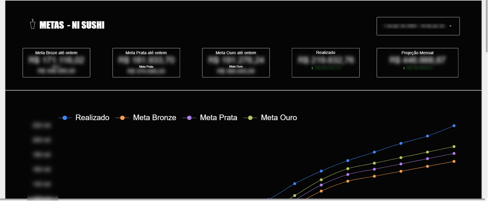
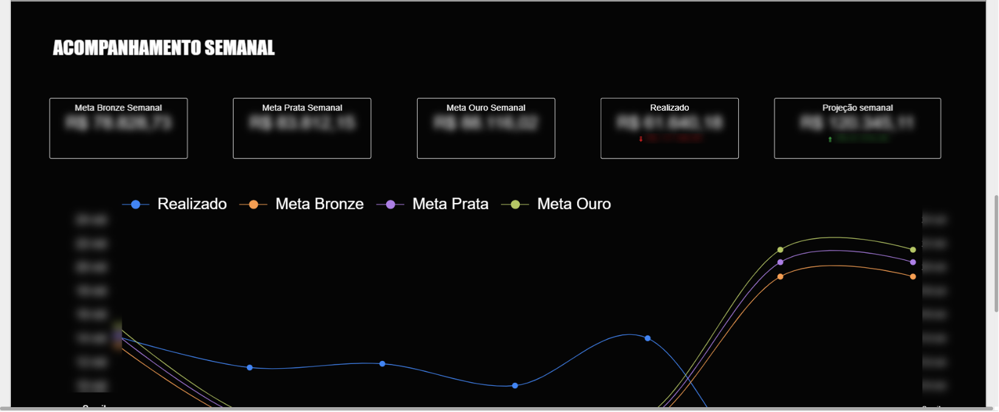

# 02 · Dashboard de Análise e Acompanhamento de Metas

> Metas escalonadas (Bronze / Prata / Ouro) acompanhadas dia a dia contra o realizado, com projeção de fechamento do mês.

## Contexto

A empresa trabalha com metas de faturamento escalonadas em três níveis — Bronze, Prata e Ouro — que definem bonificações da equipe. O time precisava saber, **a qualquer momento do mês**, se o ritmo de vendas era suficiente para alcançar cada nível, sem esperar o fechamento.

## O que o painel entrega

- **Cartões de posição:** meta Bronze/Prata/Ouro acumulada "até ontem" vs. realizado, com indicação visual de qual nível está sendo batido;
- **Projeção mensal:** extrapolação do ritmo atual para estimar o fechamento;
- **Curvas acumuladas:** realizado vs. as três curvas de meta ao longo do mês — a distância entre as linhas mostra folga ou atraso em relação a cada nível;
- **Acompanhamento semanal:** o mesmo raciocínio recortado por semana, com metas semanais, realizado e projeção da semana — horizonte de reação mais curto para a operação.

## Arquitetura e fontes de dados

Vendas realizadas vêm da mesma base alimentada via **API do ERP (Apps Script → Google Sheets)** do projeto [01](../01-dashboard-faturamento/); as curvas de meta são parametrizadas em planilha (com sazonalidade por dia da semana) e cruzadas no Looker Studio.

## Resultados (ilustrativos)

- A equipe passou a saber diariamente "quanto falta para a meta Prata da semana" — antes só se descobria no fechamento;
- Gestores usam a projeção para acionar campanhas quando o ritmo aponta fechamento abaixo do Bronze.

## Prints

*Dados desfocados; números fictícios para preservar informações internas.*

