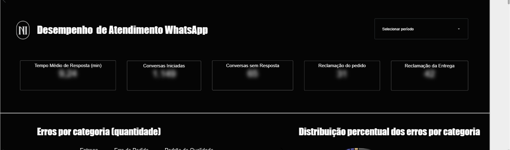
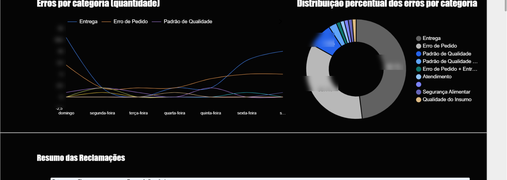

# 03 · Dashboard de Atendimento WhatsApp

> Qualidade do atendimento medida de ponta a ponta: tempo de resposta, conversas perdidas e reclamações classificadas por categoria.

## Contexto

O WhatsApp é canal central de pedidos e atendimento no delivery. Sem medição, problemas como demora na resposta, conversas sem retorno e reclamações recorrentes ficavam invisíveis para a gestão.

## O que o painel entrega

- **KPIs de atendimento:** tempo médio de resposta (min), conversas iniciadas, conversas sem resposta, reclamações de pedido e reclamações de entrega;
- **Erros por categoria ao longo da semana:** série por dia da semana (entrega, erro de pedido, padrão de qualidade...) para identificar padrões — ex.: pico de erros de entrega às sextas;
- **Distribuição percentual dos erros:** peso de cada categoria (entrega, erro de pedido, padrão de qualidade, atendimento, segurança alimentar, qualidade do insumo) no total de ocorrências;
- **Resumo das reclamações:** tabela com data, tipo e resumo de cada ocorrência registrada, para tratativa caso a caso.

## Arquitetura e fontes de dados

Registros de atendimento e ocorrências são lançados de forma padronizada em **Google Sheets** (formulário interno da equipe), com classificação por categoria; o Looker Studio consolida em visão gerencial com filtro de período.

## Resultados (ilustrativos)

- Redução do tempo médio de resposta após a exposição do indicador para o time (~9 min → ~5 min);
- A categoria dominante de reclamação (entrega) passou a ter plano de ação específico com a logística.

## Prints

*Dados desfocados; números fictícios para preservar informações internas.*

