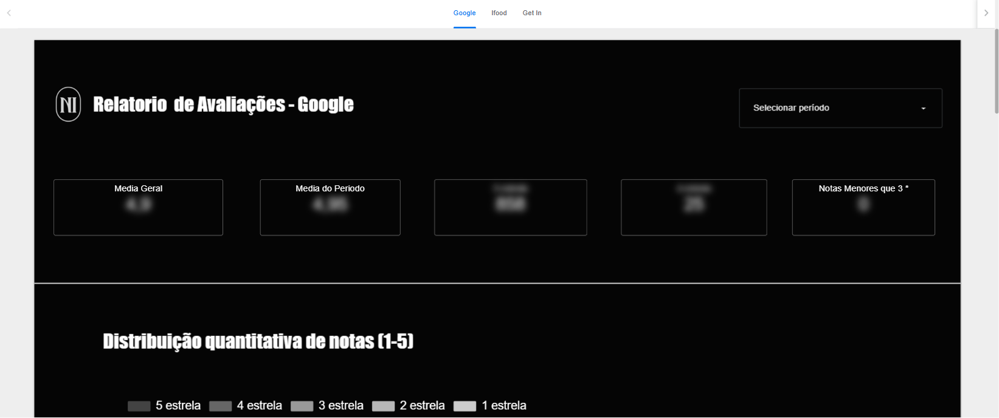

# 04 · Dashboard de Avaliações Multicanal

> As avaliações dos clientes no Google, no iFood e no sistema interno de pesquisa, consolidadas em um único relatório navegável por canal.

## Contexto

A reputação do restaurante se constrói em canais separados — Google Maps, iFood e a pesquisa de satisfação interna — cada um com sua escala e seu ritmo. Olhar cada canal isoladamente escondia o quadro geral e atrasava a reação a quedas de nota.

## O que o painel entrega

Uma página por canal (**Google · iFood · sistema interno**), cada uma com:

- **Média geral e média do período** selecionado (com filtro de datas);
- **Contagem por faixa de nota** (5 estrelas, 4 estrelas, notas menores que 3) — as notas baixas ganham destaque próprio por serem o gatilho de tratativa;
- **Distribuição quantitativa de notas (1–5)** ao longo do tempo, para acompanhar tendência.

## Arquitetura e fontes de dados

Avaliações dos três canais são centralizadas em **Google Sheets** (exportações/registros padronizados por canal) e visualizadas no Looker Studio com uma página por origem, mantendo comparabilidade entre canais.

## Resultados (ilustrativos)

- Toda avaliação abaixo de 3 estrelas passou a gerar tratativa individual — o painel funciona como fila de trabalho;
- A comparação entre canais revelou que a nota do iFood reagia à performance de entrega, direcionando o investimento para a logística.

## Prints

*Dados desfocados; números fictícios para preservar informações internas.*

