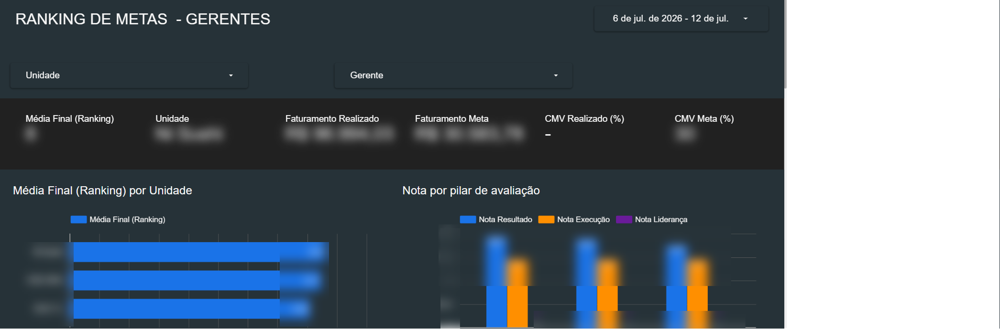

# 05 · Dashboard de Metas dos Gerentes

> Ranking objetivo de gerentes por unidade, combinando resultado financeiro, execução operacional e liderança em uma média final comparável.

## Contexto

A gestão precisava avaliar gerentes de unidades diferentes com critérios uniformes — e transformar essa avaliação em um ranking transparente, que sustentasse decisões de bonificação e desenvolvimento sem subjetividade.

## O que o painel entrega

- **Cartão-resumo por unidade/gerente** (com filtros): média final no ranking, faturamento realizado vs. meta, CMV realizado vs. meta;
- **Média final por unidade:** barras comparando as unidades do grupo na nota consolidada;
- **Nota por pilar de avaliação:** para cada gerente, a abertura da nota em três pilares — **Resultado** (indicadores financeiros), **Execução** (padrões operacionais) e **Liderança** — evidenciando onde cada um precisa evoluir;
- Filtro por unidade e por gerente, com recorte semanal do período de apuração.

## Arquitetura e fontes de dados

Os indicadores financeiros (faturamento, CMV) vêm da base alimentada via **API do ERP**; as notas de execução e liderança vêm de avaliações estruturadas registradas em **Google Sheets**. O Looker Studio cruza as fontes e calcula a média final ponderada.

## Resultados (ilustrativos)

- O ciclo de avaliação de gerentes passou de percepção qualitativa para uma nota composta auditável;
- A abertura por pilar direcionou planos de desenvolvimento individuais (ex.: gerente forte em resultado, mas com gap de execução).

## Prints

*Dados desfocados; números fictícios para preservar informações internas.*

