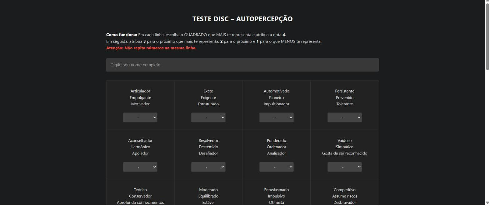

# 06 · Sistema de Teste DISC com Análise por IA

> Sistema próprio, de ponta a ponta, para aplicar teste de perfil comportamental DISC em entrevistas — do formulário web à análise automatizada do candidato por IA, direto na planilha do RH.

## Contexto

O processo seletivo usava testes DISC aplicados em papel ou ferramentas externas pagas, com tabulação manual das respostas. A empresa precisava de uma solução própria, gratuita e integrada ao fluxo de recrutamento.

## Como funciona

1. **Formulário web (Google Apps Script):** o candidato acessa um link e responde o teste de autopercepção — em cada linha de adjetivos, atribui notas de 4 (mais se identifica) a 1 (menos se identifica), com validação que impede notas repetidas na mesma linha;
2. **Gravação estruturada:** as respostas são salvas automaticamente em **Google Sheets**, com identificação do candidato e data;
3. **Cálculo do perfil:** a pontuação é consolidada nas dimensões **D** (Dominância), **I** (Influência), **S** (Estabilidade) e **C** (Conformidade);
4. **Painel de análise via IA:** integrado à própria planilha, um painel envia o perfil do candidato para um modelo de IA e retorna uma análise interpretativa — pontos fortes, riscos, estilo de comunicação e aderência à vaga — que o entrevistador usa como apoio na decisão.

```
Candidato ──► Web App (Apps Script/HTML) ──► Google Sheets ──► Cálculo DISC ──► Análise via IA ──► Painel para o RH
```

## Destaques técnicos

- Front-end e back-end no mesmo ecossistema (Apps Script + HTML/CSS/JavaScript), sem custo de infraestrutura;
- Validação de consistência das respostas no cliente (impede notas duplicadas por linha);
- Integração com IA diretamente na planilha, sem o RH sair da ferramenta que já usa.

## Resultados (ilustrativos)

- Tabulação automática eliminou o retrabalho de correção manual dos testes;
- A análise por IA padronizou a leitura dos perfis entre entrevistadores diferentes.

## Prints


