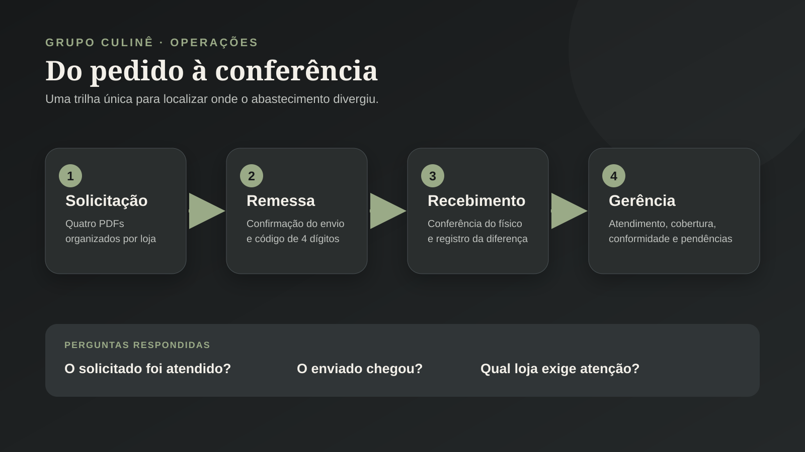
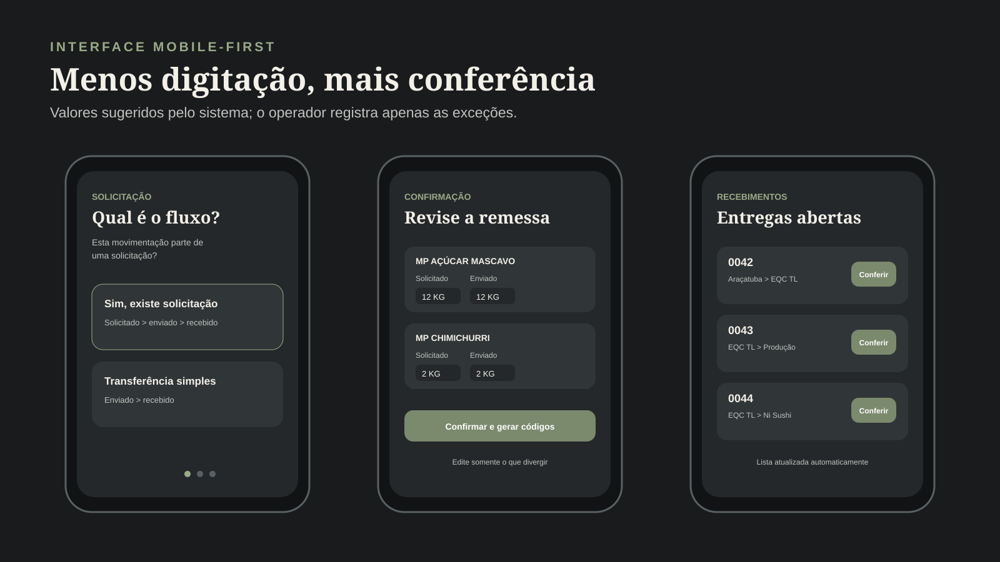

# 07 · Sistema de Controle de Remessas e Recebimentos

> Web app responsivo para acompanhar o abastecimento entre as unidades do Grupo Culinê, desde a solicitação até a conferência do recebimento.

## Contexto

O controle das transferências entre **Eu Quero Café Araçatuba**, **Eu Quero Café Três Lagoas**, **Cozinha de Produção** e **Ni Sushi** era feito em planilhas e listas preenchidas manualmente. Além do retrabalho operacional, esse formato dificultava responder três perguntas básicas:

1. O que cada unidade solicitou?
2. O que realmente foi enviado?
3. O que chegou ao destino e onde ocorreu a divergência?

Desenvolvi uma aplicação única para registrar essas etapas, reduzir a digitação no celular e transformar os registros operacionais em informação gerencial.

## Fluxo operacional

O sistema atende dois cenários:

- **Com solicitação:** acompanha `solicitado > enviado > recebido`;
- **Transferência simples:** acompanha apenas `enviado > recebido`.

No fluxo com solicitação, o operador envia quatro PDFs de uma vez:

- lista do carro, referente ao trecho **Araçatuba > EQC Três Lagoas**;
- lista dos itens destinados à **EQC Três Lagoas**;
- lista dos itens destinados à **Cozinha de Produção**;
- lista dos itens destinados ao **Ni Sushi**.

O sistema interpreta os documentos, identifica produto, unidade, quantidade e destino, mantém as etapas logísticas separadas e preenche o enviado com o valor solicitado. O operador altera somente as exceções antes de confirmar.



## Como funciona

1. **Solicitação:** importa os PDFs e organiza o pedido por unidade;
2. **Confirmação da remessa:** registra o que efetivamente saiu e gera um código de quatro dígitos para cada entrega;
3. **Recebimento:** mostra as entregas em aberto e preenche o recebido com o valor enviado, permitindo alterar apenas divergências;
4. **Produtos:** colaboradores mantêm o catálogo utilizado nas operações;
5. **Gerência:** consolida atendimento, remessas, recebimentos, pendências e divergências por loja, com filtros e exportação em CSV e PDF.



## Arquitetura

```text
PDFs operacionais
      |
      v
PDF.js no navegador -- extração e classificação das linhas
      |
      v
Interface HTML/CSS/JavaScript -- revisão pelo operador
      |
      v
Google Apps Script -- validação, regras de negócio e concorrência
      |
      v
Google Sheets -- solicitações, remessas, recebimentos e catálogo
      |
      +--> Painel gerencial
      +--> Relatório PDF
      +--> Exportação CSV
```

## Destaques técnicos

- **Leitura semiautomática dos PDFs:** parser preparado para os quatro modelos usados na operação;
- **Processamento no navegador:** os PDFs são lidos com PDF.js e não são armazenados no Google Drive;
- **Modelo de três etapas:** solicitado, enviado e recebido permanecem separados para localizar o ponto da quebra;
- **Rotas independentes:** a chegada do carro em Três Lagoas não é somada à redistribuição para as unidades finais;
- **Códigos de quatro dígitos:** armazenados como texto para preservar zeros à esquerda;
- **Interface mobile-first:** campos grandes, navegação inferior e recebimento com valores pré-preenchidos;
- **Controle de concorrência:** uso de lock no Apps Script para evitar códigos duplicados em operações simultâneas;
- **Estrutura autorreparável:** o backend recria abas obrigatórias ausentes sem apagar registros existentes;
- **Área gerencial protegida:** autenticação no servidor e sessão temporária;
- **Relatórios sem permissões adicionais:** apresentação em PDF gerada no navegador, sem criar arquivos no Google Slides ou Drive.

## Decisões de usabilidade

- Quantidades **enviadas** começam iguais às solicitadas;
- Quantidades **recebidas** começam iguais às enviadas;
- O operador edita somente aquilo que divergiu;
- A tela de recebimento apresenta todas as entregas ainda abertas;
- Cada código abre uma conferência separada, preservando a lista de pendências;
- Produtos novos identificados nos PDFs podem entrar no catálogo durante o fluxo.

## Resultado para o negócio

- Substituição de listas manuais por um processo rastreável;
- Menos digitação durante a conferência pelo celular;
- Separação clara entre falha de atendimento, falha de envio e diferença no recebimento;
- Histórico centralizado para análise por data, loja e status;
- Visão gerencial pronta para reuniões e acompanhamento de irregularidades.

## Material de treinamento

O projeto também inclui um [guia rápido em PDF](docs/guia-treinamento-grupo-culine.pdf), criado para acompanhar o treinamento prático dos operadores.

## Stack

`Google Apps Script` · `JavaScript` · `HTML5` · `CSS3` · `Google Sheets` · `PDF.js`

> 🔒 O código da aplicação e os dados operacionais não são publicados. Os visuais deste portfólio são demonstrativos e preservam informações internas da empresa.
