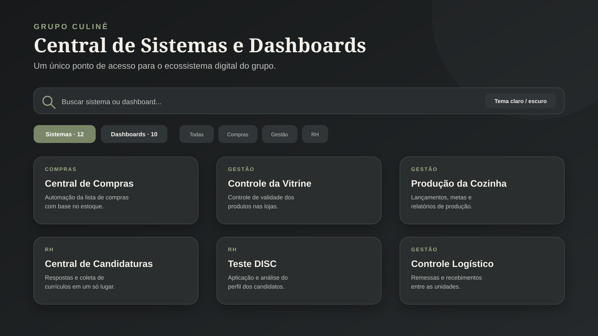

# 08 · Central de Sistemas e Dashboards

> Portal interno criado para concentrar, organizar e facilitar o acesso aos aplicativos e painéis desenvolvidos para o Grupo Culinê.

## Contexto

À medida que novos sistemas, formulários, planilhas e dashboards foram sendo criados, os links passaram a ficar espalhados em conversas, favoritos e documentos. Isso aumentava o tempo para encontrar cada ferramenta e dificultava a adoção das soluções pelas equipes.

Desenvolvi uma central única para transformar esse conjunto de links em um catálogo pesquisável, organizado por área e acessível tanto pelo computador quanto pelo celular.

## O que a central entrega

- Separação entre **Sistemas** e **Dashboards**;
- Busca por nome ou descrição;
- Filtros por categoria, como Compras, Gestão, RH, Faturamento, Atendimento, Avaliações e Metas;
- Cards com nome, resumo e acesso direto a cada ferramenta;
- Alternância entre tema claro e escuro;
- Botão de sugestão de melhoria em cada item;
- Layout responsivo para uso pelas equipes nas unidades.

Na versão documentada, a central reúne **12 sistemas** e **10 dashboards** das áreas operacionais, gerenciais e de RH.



## Exemplos de soluções centralizadas

### Sistemas

- Central de Compras;
- Controle da Vitrine;
- Controle de Produção da Cozinha;
- Controle de Produção do Ni Sushi;
- Relatórios Diário e Semanal dos Gerentes;
- Central de Candidaturas;
- Gestão de Freelancers;
- Teste DISC e visualização dos resultados;
- Venha Trabalhar Conosco;
- Controle Logístico do Grupo Culinê.

### Dashboards

- Faturamento e produtos por unidade;
- Atendimento via WhatsApp;
- Avaliações multicanal de clientes;
- Acompanhamento de metas das unidades.

## Fluxo de uso

```text
Colaborador ou gestor
        |
        v
Central de Sistemas e Dashboards
        |
        +--> Busca por nome
        +--> Filtro por categoria
        +--> Sistemas ou Dashboards
        |
        v
Acesso direto à ferramenta escolhida
```

## Decisões de produto

- **Um único endereço:** reduz a dependência de links enviados em grupos de mensagem;
- **Descrições curtas:** ajudam o usuário a escolher a ferramenta correta antes de abrir;
- **Organização por contexto:** os filtros refletem as áreas e rotinas reais do negócio;
- **Catálogo expansível:** novas soluções podem ser incorporadas sem alterar a navegação principal;
- **Ciclo de melhoria:** cada card oferece um caminho para registrar sugestões dos usuários;
- **Identidade visual comum:** reforça que as aplicações fazem parte do mesmo ecossistema interno.

## Resultado para o negócio

- Acesso mais rápido às ferramentas internas;
- Melhor divulgação dos sistemas já disponíveis;
- Menos dúvidas sobre qual link ou dashboard utilizar;
- Experiência consistente entre diferentes soluções;
- Base organizada para expansão do ecossistema digital do Grupo Culinê.

## Acesso

[Abrir a Central de Sistemas e Dashboards](https://script.google.com/macros/s/AKfycbyX2E8uu-4IYyU9Krikmr4qKcbFia2OdyqekclIQF4rOcmkmF9icIaM0ljpFrcKLMhO/exec)

## Stack

`Google Apps Script` · `HTML5` · `CSS3` · `JavaScript` · `Google Looker Studio`

> 🔒 A central apresenta os acessos, mas cada sistema mantém suas próprias regras de permissão e proteção de dados.
