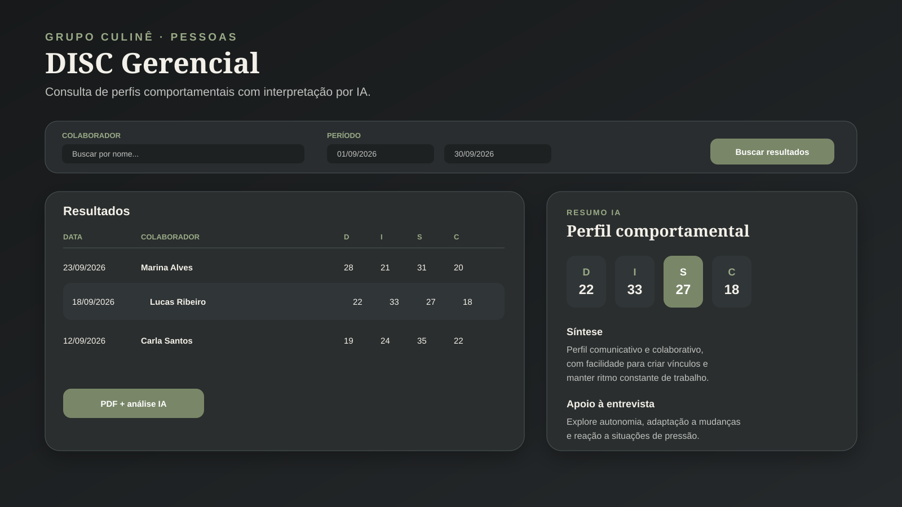

# 09 · Painel Gerencial DISC com Análise por IA

> Aplicação restrita para o RH consultar resultados DISC, interpretar perfis comportamentais com apoio de IA e gerar relatórios individuais em PDF.

## Contexto

O sistema de aplicação do teste DISC automatizou a coleta e o cálculo das quatro dimensões comportamentais. Ainda era necessário transformar as pontuações em uma leitura prática para entrevistas, seleção e desenvolvimento das equipes.

Desenvolvi um painel gerencial separado para concentrar os resultados, permitir consultas rápidas e gerar uma análise interpretativa consistente com apoio de inteligência artificial.

## Como funciona

1. O candidato responde ao teste DISC no web app de aplicação;
2. As respostas são gravadas e consolidadas nas dimensões **D**, **I**, **S** e **C**;
3. O RH acessa o painel gerencial com autenticação;
4. Os resultados podem ser filtrados por nome e período;
5. Ao selecionar um colaborador, o sistema apresenta um resumo comportamental produzido por IA;
6. O painel gera um PDF individual com as pontuações e a análise interpretativa.

```text
Teste DISC
    |
    v
Google Sheets -- respostas e pontuações D / I / S / C
    |
    v
Painel gerencial em Apps Script
    |
    +--> Busca por nome e período
    +--> Resumo comportamental por IA
    +--> PDF individual com análise
```



## Funcionalidades

- Acesso restrito por usuário e senha;
- Atualização da base diretamente pelo painel;
- Filtro por nome do colaborador;
- Filtro por data inicial e final;
- Visualização das pontuações de Dominância, Influência, Estabilidade e Conformidade;
- Resumo de IA acionado ao selecionar o resultado;
- Geração de PDF individual com pontuações e análise;
- Interface responsiva alinhada à identidade do Grupo Culinê.

## Papel da IA

A IA transforma a combinação das quatro dimensões em uma leitura estruturada para apoiar o avaliador. A análise pode abordar:

- Tendências comportamentais predominantes;
- Pontos fortes observáveis;
- Possíveis pontos de atenção;
- Estilo de comunicação;
- Preferências de ambiente e ritmo de trabalho;
- Perguntas que podem aprofundar a entrevista.

A interpretação funciona como **apoio à decisão humana**. O resultado não substitui entrevista, experiência profissional, referências ou avaliação do contexto da vaga.

## Destaques técnicos

- Front-end e back-end no ecossistema Google Apps Script;
- Dados estruturados em Google Sheets;
- Autenticação e área gerencial separadas do formulário do candidato;
- Integração de IA acionada sob demanda, evitando análises desnecessárias;
- Relatório PDF gerado a partir do resultado selecionado;
- Filtros que reduzem o tempo de busca em uma base crescente de aplicações.

## Resultado para o negócio

- Centralização do histórico de testes realizados;
- Menos tempo gasto interpretando manualmente cada combinação DISC;
- Padronização da análise entre diferentes entrevistadores;
- Material individual pronto para discussão interna;
- Uso mais consistente do teste como uma das evidências do processo seletivo.

## Relação com o projeto de aplicação

Este painel complementa o [Sistema de Teste DISC](../06-sistema-teste-disc/): o projeto 06 coleta e calcula as respostas; este projeto oferece a camada gerencial de consulta, interpretação por IA e emissão do relatório.

## Stack

`Google Apps Script` · `JavaScript` · `HTML5` · `CSS3` · `Google Sheets` · `IA generativa` · `PDF`

> 🔒 O painel é de acesso restrito. O visual deste portfólio usa informações fictícias e não expõe nomes, resultados ou credenciais reais.
